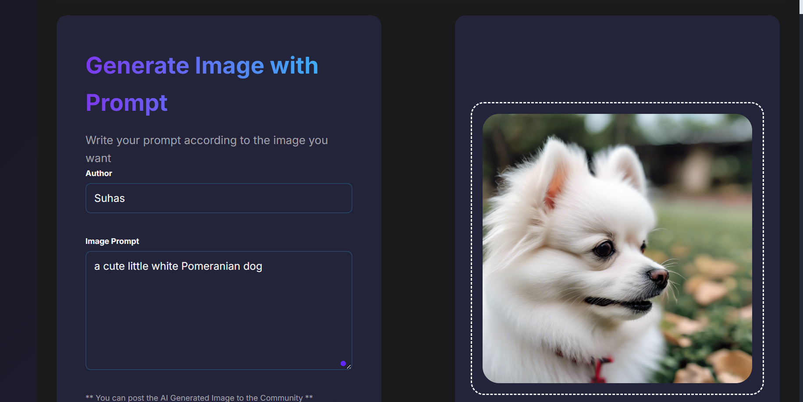

# 🎨 AI Image Generator

GENAI is an innovative web application designed to create stunning, AI-generated images from simple text prompts. Built using React, OpenAI API, Vite, and TailwindCSS, GENAI combines cutting-edge AI technology with a sleek, responsive interface. Whether for creative projects, marketing materials, or personal use, GENAI empowers users to bring their imagination to life with ease.

## 🌐 Live Demo
**[Try it now!](https://genai-qw8m.onrender.com)**

## 🚀 Features
- AI-powered image generation from text prompts
- Community gallery to explore and share creations
- Responsive design for all devices
- Real-time image generation using OpenAI API

## 🛠️ Tech Stack
- **Frontend**: React, Styled Components
- **Backend**: Node.js, Express
- **Database**: MongoDB
- **AI**: OpenAI API
- **Deployment**: Render

